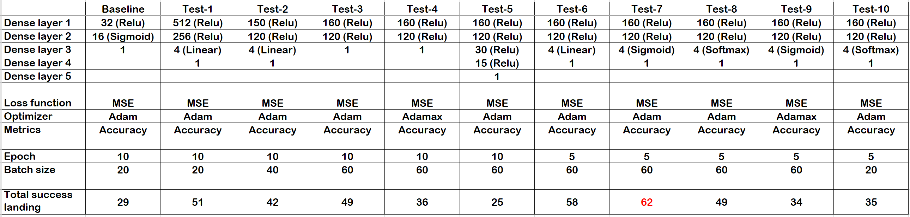
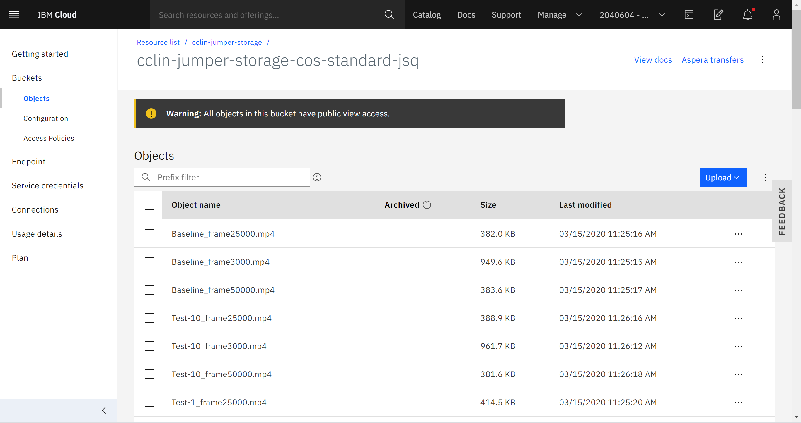
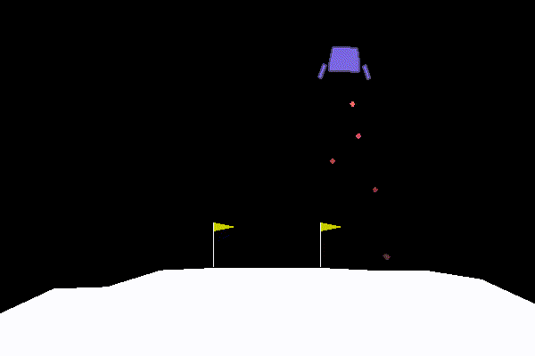
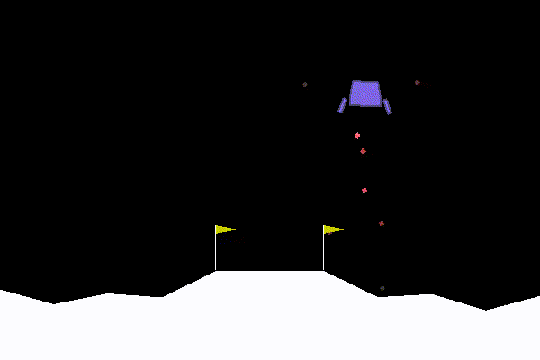
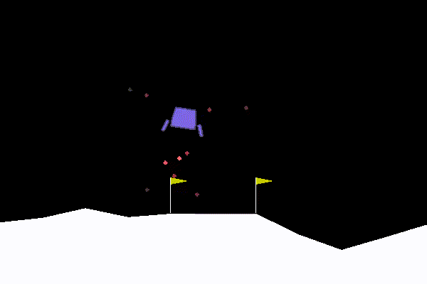
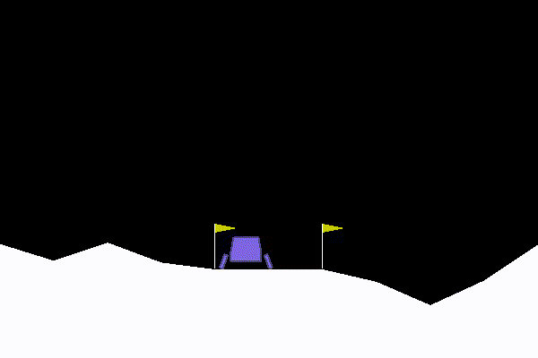

# Homework 11_Curtis Lin

## Summary and question responses of HW11

### 1. Paramter testing summary

- red font indicates the best model

### 2. Parameters of trying

In this assignmnet, I first ran defalut setting as a baseline model and total successful landing is 29. For the first five tests (Test-1 to Test-5), I randomly changes `node numbers`, `layer numbers`, `final activation function`, `optimizer`, and `batch size`. Next, I chose the parameters from first 5 trials which potentially improved the total successful landing to further study the effect of `final activation functions`, `optimizers`, and `batch-sizes`. 

### 3. Conclusion

Based on the 10 testing, the conclusions were listed below. 

- Node sizes: 
    - The performance was improved when increaing the node sizes by comparing baseline (29 succesful landing) and test-1 (51 succesful landing). 

- Number of dense layers: 
    - In this case, increasing the number of dense layers caused worse performace (25 succesful landing; test-5) in the comparison to baseline (29 succesful landing) and test-3 (49 succesful landing) which had same batch size. 

- Optimizer:
    - In the comparison to test-7 and test-9, `adam` optimizer (62 succesful landing; test-7) outperformed `adamax` (34 successful landing, test-9). 

- Final activation function:
    - `Sigmoid` (62 succesful landing; test-7) showed better performance in the comparision to `linear` (58 succesful landing; test-6) and `softmax` (49 succesful landing; test-8).

- Batch size:
    - Increasing the batch size improved the performance. Here, `batch size = 60` (62 succesful landing; test-7) had better performance in the comparison to `batch size = 20` (35 succesful landing; test-10) 

## Videos of best models in object storage

### 1. File stroage

- All video files have been stored in IBM object storage as showed below.

### 2. Baseline model:

- Baseline: `29` succesful landing
    - Video link: http://s3.us-east.cloud-object-storage.appdomain.cloud/cclin-jumper-storage-cos-standard-jsq/Baseline_frame50000.mp4

    

### 3. Best models:
- Test-7: `62` succesful landing
    - Video link: http://s3.us-east.cloud-object-storage.appdomain.cloud/cclin-jumper-storage-cos-standard-jsq/Test-7_frame50000.mp4

    - 

- Test-6: `58` succesful landing
    - Video link: http://s3.us-east.cloud-object-storage.appdomain.cloud/cclin-jumper-storage-cos-standard-jsq/Test-6_frame50000.mp4

    - 

- Test-1: `51` succesful landing
    - Video link: http://s3.us-east.cloud-object-storage.appdomain.cloud/cclin-jumper-storage-cos-standard-jsq/Test-1_frame50000.mp4

    

