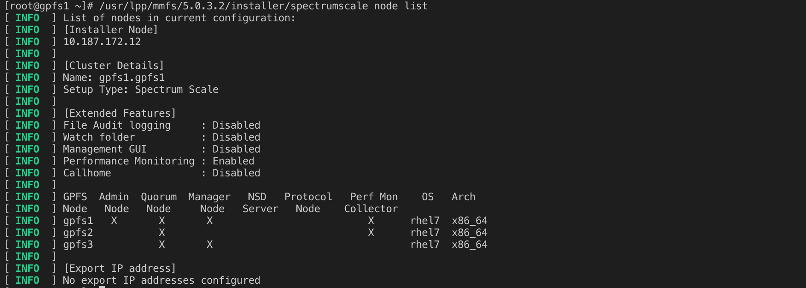

# Homework 12_Curtis Lin

## Summary of HW12

### Part 1 - Installing GPFS FPO

- 1. Nodes adding for GPFS installation 

    

- 2. Successful GPFS installation
    
    

- 3. Cluster installed

    

- 4. Activating GPFS

    

- 5. Mounting the distributed FS

    

- 6. Writing on distributed FS

    
    

### Part 2 - LazyNLP Crawler library

- crawl Gutenberg AUS and Gutenberg US datasets

    


### Questions 

- How much disk space is used after step 4?

    - The `aus_gut.urls` has *3953* urls. After crawled, the size of  `aus_gutemberg_dataset` is 1.1G. The  `us_gutemberg` has *57671* lines and take about 24 hours to crawled. For 230 million urls of reddit urls, it will take several days to run even though the task was distribute to 2 nodes. Therefore, the disk space that is used still remains unknown. 

- Did you parallelize the crawlers in step 4? If so, how?

    - The reddit urls were paritioned into 2 folder based on the `.bz2.deduped.txt` and `.xz.deduped.txt`. Next, two `.py` files (`crawler_reddit-p1.py` and `crawler_reddit-p2.py`) were generated to craweled webpages using **gpfs2** and **gpfs3** nodes. (The gpfs1 was used to crawled Gutenberg US dataset simultaneously)

    

    

    - code of `crawler_reddit-pX.py`

    ```
    import os
    import random
    import shutil
    import lazynlp
    from pybloom import BloomFilter

    def create_reddit_data():
        main_path = "/gpfs/gpfsfpo/reddit_urls/reddit_urls_p1"
        urls = os.listdir(main_path)
        for url in urls:
            print(url)
            tmp_path = os.path.join(main_path, url)
            lazynlp.download_pages(tmp_path, "/gpfs/gpfsfpo/reddit_dataset", timeout=30, default_skip=True, extensions=[], domains=[])

    def main():
        create_reddit_data()

    if __name__ == '__main__':
        main()
    ```

- Describe the steps to de-duplicate the web pages you crawled.

    - Both reddit webpages crawled by gpfs2 and gpfs3 were saved in the same folder. If there are duplicates, the files may be overwritten. 

- Submit the list of files you that your LazyNLP spiders crawled (ls -la).

    - list of reddit files

     