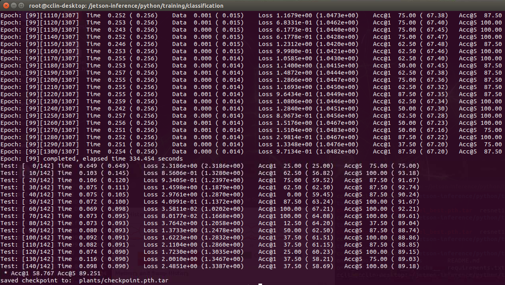
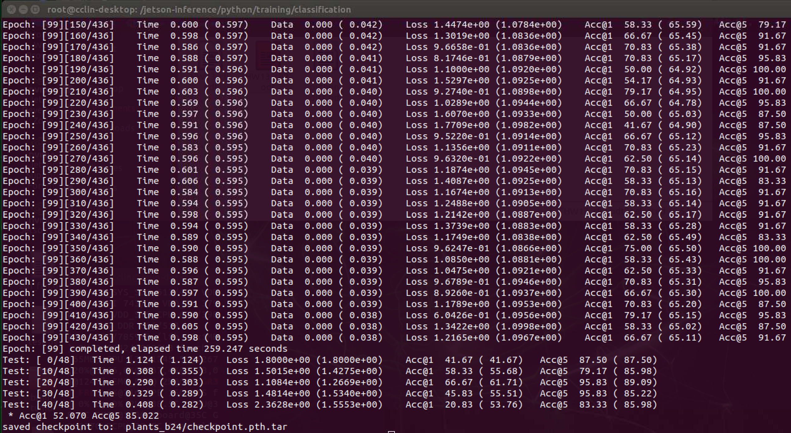

# Homework 13_Curtis Lin

## Summary and question responses of HW13

### 1. Train for 100 epochs

- To run 100 epochs, the argument `--epochs 100` was added.

    ```
    python3 train.py --epochs 100 --model-dir=plants /data/datasets/PlantCLEF_Subset
    ```

- Results

    

    > Each epoch took around 334 seconds for training and around 89 seconds for testing. Therefore, for 100 epochs, the total runtime was close to 11.8 hours. 

    > Acc@1 58.767 and Acc@5 89.251


### 2. Change batch size to 24

- To run 100 epochs, the argument `--batch-size 24` was added.

    ```
    python3 train.py --epochs 100 --batch-size 24 --model-dir=plants /data/datasets/PlantCLEF_Subset
    ```

- Results

    

    > Each epoch took around 259 seconds for training which is shorter than default batch-size=8. Also, the testing runtime is much shorter than batch-size=8. The total runtime of epochs=100 and batch-size=24 was close to 7.2 hours. 

    > Acc@1 52.070 and Acc@5 85.022