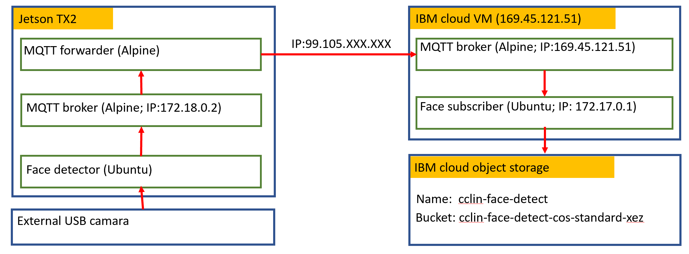

# Homework 3 - Internet of Things 101_Curtis Lin

## Goal of assignment
1. Capture faces in a video stream coming from the edge in real time (Jetson TX2 with external USB webcam)
2. Publish face image through Jatson TX2 MQTT broker (Alpine)
3. Transmit them to the cloud in real time (MQTT broker and forwarder on Jetson TX2, MQTT broker on IBM cloud VM)
4. Subsribe face image through IBM cloud VM broker (Alpine)
5. Write and store images on IBM cloud object storage

## Summary of architecture 


## 
## Steps 

## ON Jetson TX2  

### 1. Build docker images for opencv and MQTT
    
- Opencv-python3: /TX2_files/Dockerfile.ocv-p3-mqtt
    ```
    sudo docker build --network=host -t opencv-python3-mqtt -f Dockerfile.ocv-p3-mqtt .
    ```
- Mosquitto MQTT: /TX2_files/Dockerfile.apk_mqtt
    ```
    sudo docker build --network=host -t mqtt_alpine -f Dockerfile.apk_mqtt .
    ```
### 2. Create network and linker for TX2 docker containiers

- link name: hw3; IP address: 172.18.0.0/16 
    ```
    sudo docker network create --subnet=172.18.0.0/16 hw3
    ```

### 3. Run docker containers
- MQTT broker, forwarder, and face detector container were linked by `hw3`

- MQTT broker containers: mqtt-jx2-broker; config file: /TX2_files/jx2_broker.conf
    ```
    sudo docker run --name mqtt-jx2-broker --network hw3 --rm -p 1883:1883 -v /home/MIDS-W251/HW3:/HW3 -d mqtt_alpine -c /TX2_files/jx2_broker.conf
    ```
- MQTT forwarder containers: mqtt-jx2-forwarder; config file: /TX2_files/jx2_forwarder.conf
    ```
    sudo docker run --name mqtt-jx2-forwarder --network hw3 --rm -v /home/MIDS-W251/HW3:/HW3 mqtt_alpine -c /TX2_files/jx2_forwarder.conf
    ```
- Opencv-python face detector container: face-detector
    
    **First enter X environment**
    ```
    xhost + local:root
    ```
    **Next, spin up docker face detector container** 
    ```
    sudo docker run -e DISPLAY=$DISPLAY --name face-detector --network hw3 --rm --privileged -v /tmp:/tmp -v /home/MIDS-W251/HW3:/home -ti opencv-python3-mqtt bash  
    ```
### 4. Run face detect python file: /TX2_files/face_detector.py 

- Inside opencv-python3-mqtt container bash, run
    
    ```
    python3 /TX2_files/face_detector.py
    ```
### 5. Once face detection start, you will see following log


## ON IBM cloud

### 1. Create a IBM cloud VM as instructed in week2/hw and week2/labs
- cloud name: cclinmqtt.cclin.cloud (IP address: 169.45.121.51)
    - SSH into the VM and edit `/etc/ssh/sshd_config` with following changes
    ```
    PermitRootLogin prohibit-password
    PasswordAuthentication no
    ```
- Restart the ssh daemon: `service sshd restart`

### 2. Install DockerCE with .sh file: /IBMcloud_files/Docker_install.sh

```
chmod + /IBMcloud_files/Docker_install.sh
/IBMcloud_files/Docker_install.sh
```

### 3. Create IBM S3 object storage as instructed in week02/lab2
- Object storage name: cclin-face-detect

### 4. Add cloud storage to server
- Provide credentials to VM for access object storage
```
echo "<Access_Key_ID>:<Secret_Access_Key>" > $HOME/.cos_creds
```
- Give authority
```
chmod 600 $HOME/.cos_creds
```

### 5. Mount a bucket of object storage to VM 
- Create a directory in VM for mounting
```
sudo mkdir -m 777 /mnt/cclin-HW3-images 
```
- Create a bucket in IBM object storage:
    - Bucket name: cclin-face-detect-cos-standard-xez

- Mount object storage bucket to VM
```
s3fs cclin-HW3-images /mnt/cclin-HW3-images -o passwd_file=$HOME/.cos_creds -o sigv2 -o use_path_request_style -o url=https://s3.us.cloud-object-storage.appdomain.cloud
```

### 6. Build docker images for opencv and MQTT
    
- Opencv-python3: /IBMcloud_files/Dockerfile.ocv-p3-mqtt
    ```
    docker build --network=host -t opencv-python3-mqtt -f /IBMcloud_files/Dockerfile.ocv-p3-mqtt .
    ```
- Mosquitto MQTT: /IBMcloud_files/Dockerfile.apk_mqtt
    ```
    docker build --network=host -t mqtt_alpine -f /IBMcloud_files/Dockerfile.apk_mqtt .

### 7. Run docker containers

- MQTT broker container: mqtt-ibm-broker
    
    ```
    docker run --name mqtt-ibm-broker -p 1883:1883 -v /home/MIDS-W251/HW3:/home mqtt-alpine mosquitto
    ```
    - can add flag `-d` to run container in background

- MQTT subcriber container: mqtt-ibm-sub

    ```
    docker run --name mqtt-ibm-sub -v /home/MIDS-W251/HW3:/home -v /mnt/cclin-HW3-images:/cclin-HW3-images -ti opencv-python3-mqtt bash
    ```

### 8. Run face image subscribe python file

- Inside mqtt-ibm-sub container bash, run 
    ```
    python3 /IBMcloud_files/face-subscriber.py
    ```


## 
## Implementation

### 1. When all containers connected correctly, the log of IBM cloud broker will show connection from TX2 forwarder and IBM cloud VM subscriber. The log is showed below.


### 2. From IBM cloud subscriber, the log will be showed as below. 


### 3. The detected face images will be stored on object storage bucket (cclin-face-detect-cos-standard-xez). The files can be accessed with the link: http://s3.us-south.cloud-object-storage.appdomain.cloud/cclin-face-detect-cos-standard-xez/face_1.png

- By change number in file name (face_**number**.png), the different images will be showed. 

- Face detect examples:
    - USB Camara View
    

    - Face detect example 1:

    

    - Face detect example 2:

    


## 
## Discussion of usage of naming of the MQTT topics and the QoS 

### 1. Naming of the MQTT topics
- Here, the purpose of design is for detecting face. Therefore, the MQTT topics is named as "face_detect". 
- To provide ability on extending topics in the future, I used multi-level wildcard (/#). With this setting, it allow me to create series of topics to detect different parts of face, such as face_detect/face, face_detect/eye, face_detect/nose etc...

### 2. The QoS
- The QoS that I used is `1` with following reason;
    - it guarantees the message arrives at least once but allows for multiple deliveries
    - QoS 1 delivers messages much faster than QoS 2
    - all messages sent with QoS 1 are queued for offline clients until clients is available again
    - the message can be processed immediately
