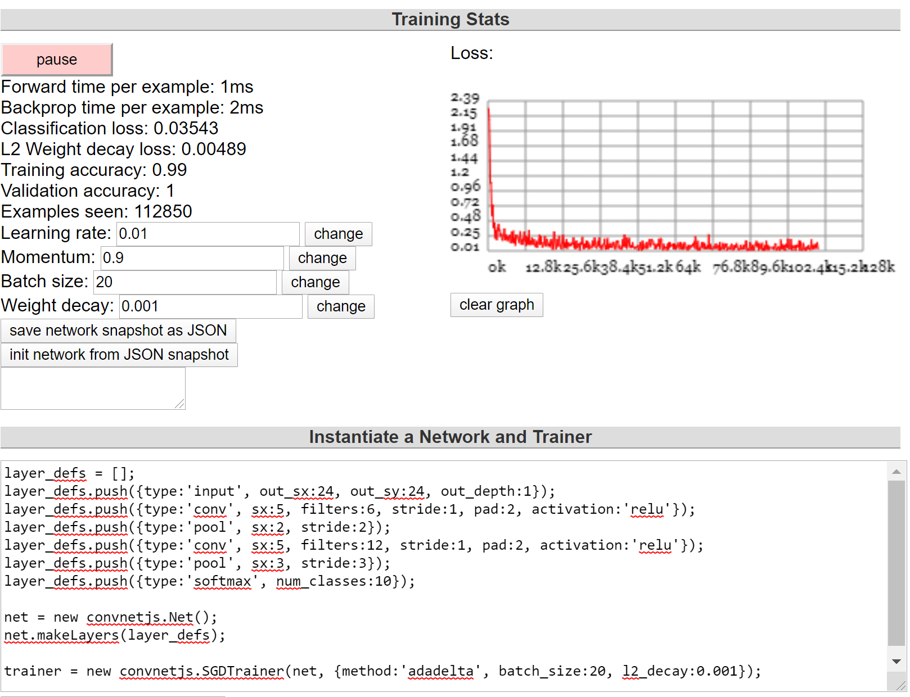

# MIDS-W251_HW4_Curtis Lin

## 2. ConvnetJS MNIST demo
In this lab, we will look at the processing of the MNIST data set using ConvnetJS. This demo uses this page: http://cs.stanford.edu/people/karpathy/convnetjs/demo/mnist.html The MNIST data set consists of 28x28 black and white images of hand written digits and the goal is to correctly classify them. Once you load the page, the network starts running and you can see the loss and predictions change in real time. Try the following:

### 1.Name all the layers in the network, make sure you understand what they do.
- Input layer: input the data
- Convolutional layer: consist of a set of learnable filters (or kernels), which have a small receptive field, but extend through the full depth of the input volume (wiki). 
- Pooling layer: reduce the spatial size; furthermore, reducing the amount of parameters and computation in the network. 
- Output layer: produce the probability of each class  given the inputs. 

### 2.Experiment with the number and size of filters in each layer. Does it improve the accuracy?
- By increasing filter number of two 'conv' layer to(16, 24), the accuracy was not improved but the foward and backprop time dramatically increased. 
- By increasing filter number of two 'conv' layer to(6, 12), the loss and accuracy were improved.

### 3.Remove the pooling layers. Does it impact the accuracy?

- Without pooling layers, the accuracy decreased but the foward and backprop time dramatically increased.

### 4.Add one more conv layer. Does it help with accuracy?

- By adding one more 'conv' layer after second pooling layer, the accuracy seems remained similar to original setting. 

### 5.Increase the batch size. What impact does it have?

- By increasing batch size to 100, each training and validation batch are increased and may reduce the fluctuation of loss. 

### 6.What is the best accuracy you can achieve? Are you over 99%? 99.5%?

- The best validation accuracy that I can achieve is over 99.5% (100%)

