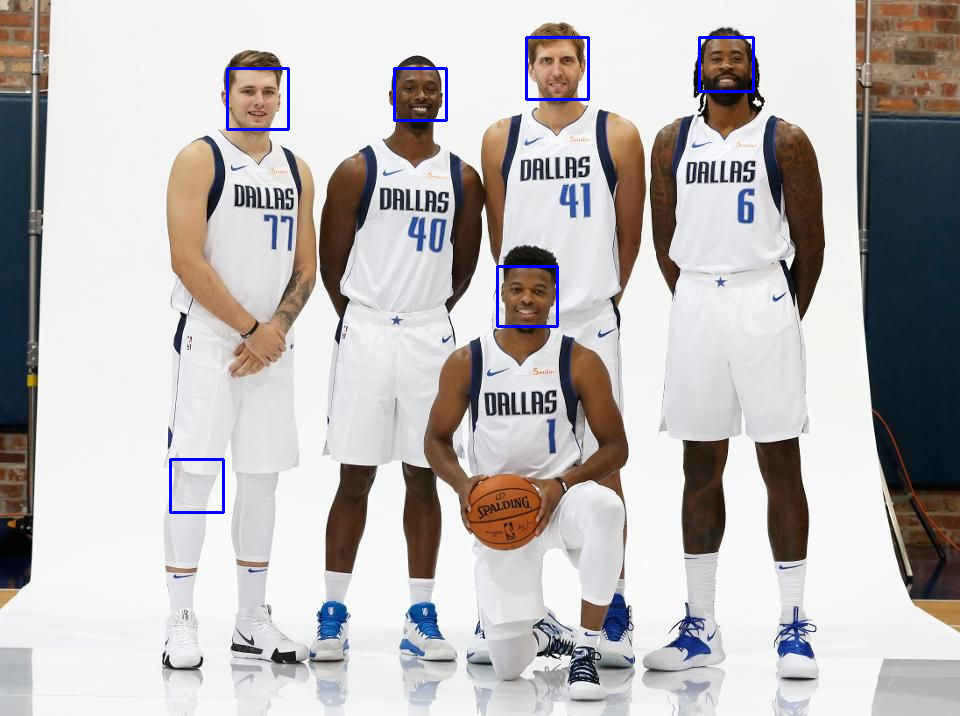
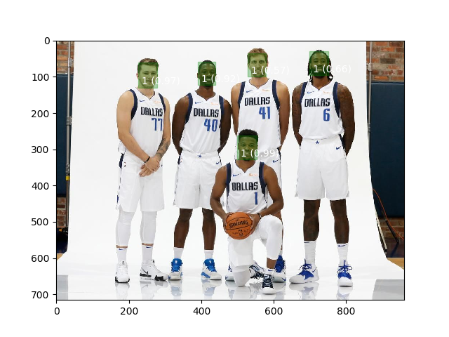

# Homework 7_Curtis Lin

## Goal:
- Perform the comparison the accuracy of face detection between OpenCV and Tensorflow. 

## Note: 

- The mqtt part was not done. However, the code can be extended for video capture with CV2 and published with Mosquitto. 

## Files

- Dockerfile.tf1-cv2-mqtt: docker container provide running face detection in Python with either OpenCV or Tensorflow

- face_detect_cv2.py: python code for OpenCV face detection

- face_detect_tf1.py: python code for Tensorflow face detection

- Both face_detect_cv2.py and face_detect_tf1.py can be extended for mqtt publisher and compatible for mqtt subscriber

## Results:

### 1. OpenCV: 

- Classified images:

- Identified faces

### 2. Tensorflow: 

- Classified images:

- Identified faces

## Questions

### Describe your solution in detail. What neural network did you use? What dataset was it trained on? What accuracy does it achieve?

- Here, I use convolutional neural network for face detection. 

- The training dataset was `frozen_inference_graph_face.pb`. The model was optimized using TensorRT.

- The highest score can reach 0.99 but some scores are lower than 0.7. The accuracy in this case is 1.  

### Does it achieve reasonable accuracy in your empirical tests? Would you use this solution to develop a robust, production-grade system?

- This model achieve reasonable accuracy based on this test. The model need to be tested with more images before making conclusion of whether this solution to develop a robust, production-grade system.

### What frame rate does this method achieve on the Jetson? Where is the bottleneck?

- Average frame rate is 0.091548 seconds. 

- The bottleneck is the optimization step using TensorRT.

### Which is a better quality detector: the OpenCV or yours?

- In this case, my detector showed better prediction in the comparison of OpenCV. OpenCV had 1 wrong detection. 