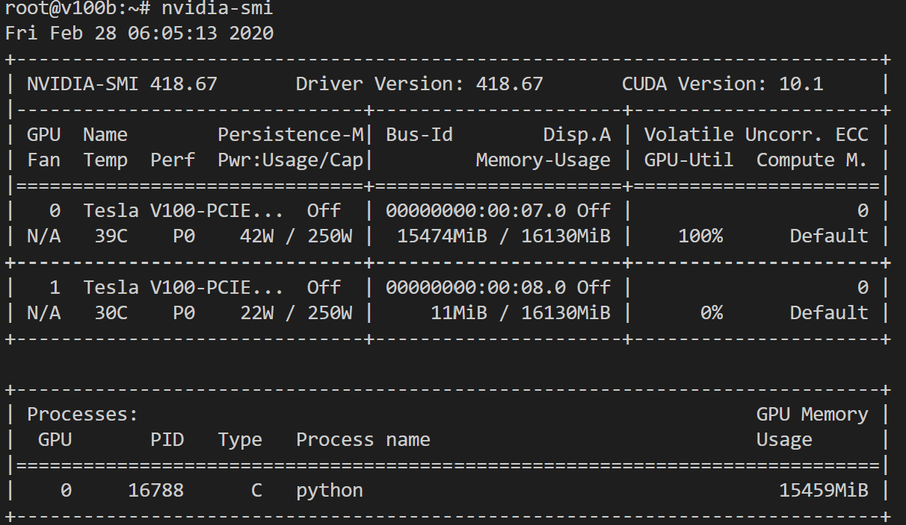
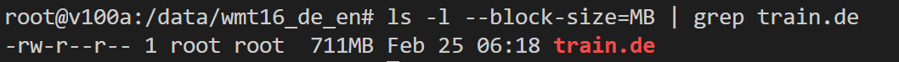

# Homework 9_Curtis Lin

## Summary of HW9

### A. Issue encountered during distributed training

Initially, I followed the instructions of setting up the 2 VM with four V100 GPUs (V100a and V100b; 2 GPUs of each VM). 

- V100a setting 

- V100b setting

Becuase V100 GPUs was used, I tried to use bitch size = 256 and mixed precision model training with 4 GPUs. However, I kept getting failures on initializations of distributed training. Therefore, in the first tried, I only succssed the distributed training with 1 GPU on V100a and 1 GPU on V100b with batch size = 128. 

After I used the `nvidia-smi` command, I saw there was only 1 GPU that I could use on V100a even though I had 2 GPUs in the IBM cloud VM setting (see V100a setting). 

- V100a smi 

- V100b smi 

Beside these issues, the first trial of distributed training was sucessful with 2 GPUs (1 on V100a and 1 on V100b). The 141.9k steps were run with runtime 47 hours (I killed the running during IBM cloud credits) The results were showed in the next section. 

Next, I would like to try whether I can utilize all 3 GPUs (1 on V100a and 2 on V100b) for the distributed training. 

- V100a smi-before distributed training

- V100b smi-before distributed training

- V100a smi-after distributed training

- V100b smi-after distributed training

The trial of fully utilizing 3 GPUs for distributed learning training was successful. Since I did not have much credit left, I only use this setting and ran 1.1K steps. 

## B. Results

- 1. Eval_BLEU_Score

> 

- 2. Loss_Optimization

> 

- 3. eval_loss

> 

- 4. global_step 

> 

- 5. learning_rate

> 

- 6. train_loss

> 

## C. Questions

### 1. How long does it take to complete the training run? (hint: this session is on distributed training, so it will take a while)

- with 2 GPUs (1 on V100a and 1 on V100b): each step took about 0.835 seconds. Therefore, for total 300k steps, it will take about 70 hours. 

> 

- with 3 GPUs (1 on V100a and 2 on V100b): each step took about 0.640 seconds. Therefore, for total 300k steps, it will take about 54 hours. 

> 

### 2. Do you think your model is fully trained? How can you tell?

- THe model seems fully trained since the value of training loss became more static without big changes (~ 1.70) 

> 

### 3. Were you overfitting?

The model might not be overfitted since the values of train_loss and eval_loss were close to each other (~1.70)

> 
> 

### 4. Were your GPUs fully utilized?

- For the first trial, I only used 2 GPUs (1 on V100a and 1 on V100b)

>  
> 

- For the second trial, I fully used 3 GPUs (1 on V100a and 3 on V100b)

> 

> 

### 5. Did you monitor network traffic (hint: apt install nmon ) ? Was network the bottleneck?

- I did monitor the network when using either 2 GPUs or 3 GPUs. The network only allow ~200000KB for transmission no matter how many GPUs you were using. Therefore, the network became the bottleneck for data shuffling between two VMs during distributed training. 

- V100a and V100b networks with 2 GPUs

> 
> 

- V100a and V100b networks with 3 GPUs

> 
> 

### 6. Take a look at the plot of the learning rate and then check the config file. Can you explan this setting?

- During distributed training, the learning rate was adjusted which can prevent the oscillation when close to global minimun or taking long time to reach global minimun. 

> 

### 7. How big was your training set (mb)? How many training lines did it contain?

- There were two training dataset `train.de` and `train.en`. `train.de` is 711MB and `train.en` is 637MB. Both `train.de` and  `train.en` have 4562102 lines.

- train.de

> 

> 

- train.en

> 

> 

### 8. What are the files that a TF checkpoint is comprised of?

- TF checkpoint files comprised `checkpoint file`, `index file`, `meta file`, and `data file`. The checkpoint files were saved in the different steps during distributed training.  

> 

### 9. How big is your resulting model checkpoint (mb)?

- The file size of each model checkpoint is 744MB. Since I have five set of check points files in best model folder. The total file size in best model folder was 3713 MB

> 

### 10. Remember the definition of a "step". How long did an average step take?

- Distributed with 2 GPUs (1 on V100a and 1 on V100b). The runtime of each step was about 0.835 sec. 

> 

- Distributed with 3 GPUs (1 on V100a and 2 on V100b). The runtime of each step was reduced to 0.835 sec. 

> 

### 11. How does that correlate with the observed network utilization between nodes?

- The V100a `Recv` was correlated with V100b `Trans` and vice versa.

> 
> 
